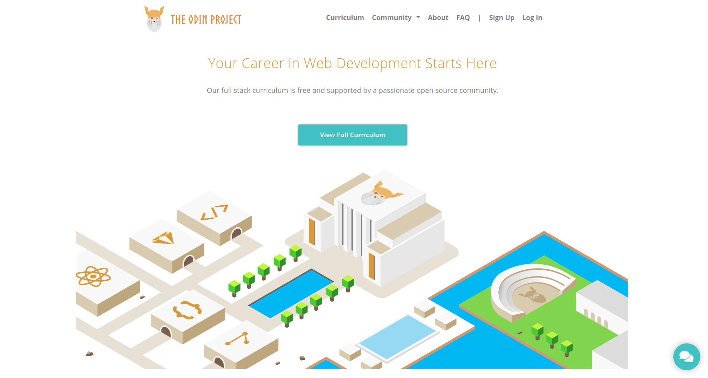
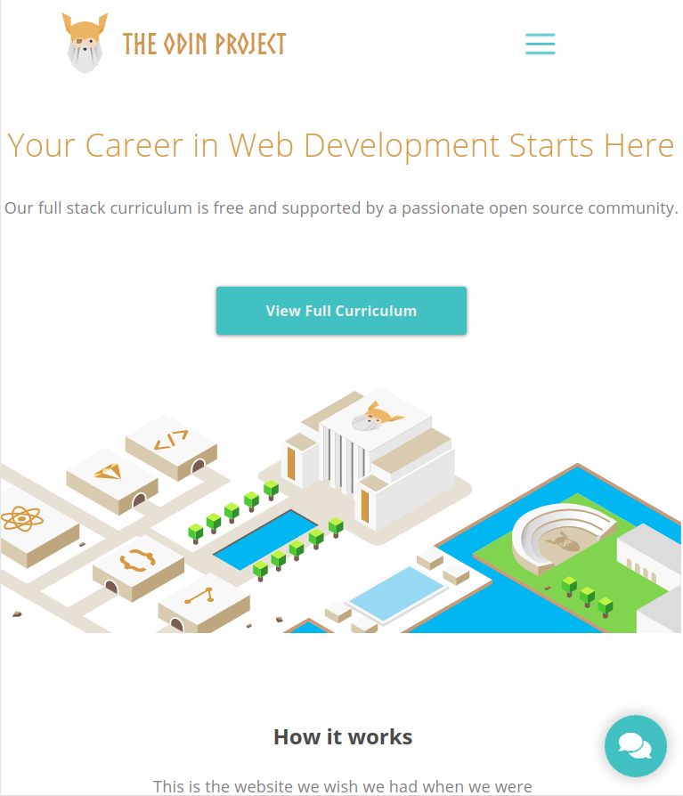
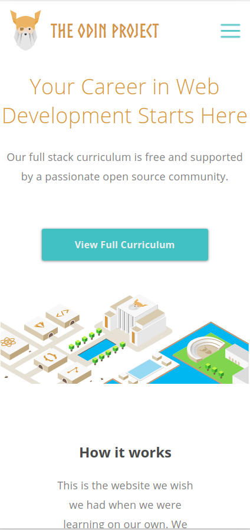

<!--
*** Thanks for checking out this README Template. 
-->

<!-- PROJECT TITLE -->

 
<h1 align="center">DESIGN YOUR OWN GRID BASED FRAMEWORK</h1>

    This assignment consists of building a grid-based framework (similar to bootstrap) that includes some basic functionality necessary to build a website. You can find the original project specification at: https://www.theodinproject.com/courses/html5-and-css3/lessons/design-your-own-grid-based-framework 
     

<!-- TABLE OF CONTENTS -->

## Table of Contents

* [About the Project](#about-the-project)
    * [Built With](#built-with)
* [Getting Started](#getting-started)
* [License](#license)
* [Contact](#contact)
* [Acknowledgements](#acknowledgements)
* [Commit Summary](#commit-summary)

<!-- ABOUT THE PROJECT -->
## About The Project

## Desktop size

  

## Tablet size

  

## Mobile size

  

### Built With 

* HTML
* CSS3
* Github
* Sass

<!-- GETTING STARTED -->
## Getting Started

Just clone or download the project and open the index.html in your browser.

<!-- LICENSE -->
## License

Distributed under the MIT License. See `LICENSE` for more information.

<!-- CONTACT -->
## Contact
* Felipe Enne - felipeenne@gmail.com  
* Ricardo Valtierra - ricardo_valtierra@outlook.com

<!-- ACKNOWLEDGEMENTS -->
## Acknowledgements

* Microverse.

